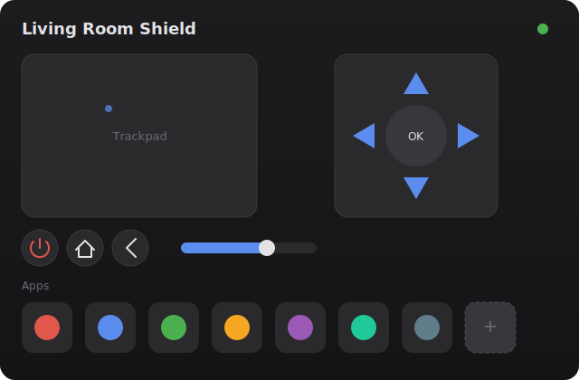

# Orbit — Nvidia Shield Remote for Home Assistant

A custom Lovelace card (`shield-remote-card`) that replaces a physical Nvidia
Shield TV remote inside Home Assistant: trackpad, D-pad, power/home/back,
volume, and one-tap app shortcuts.



*Layout mockup — not a live screenshot. Trackpad (left), D-pad cluster
(right), power/home/back and volume below, and the app shortcut grid at the
bottom.*

Full design doc: [`shield-ha-remote-spec.md`](./shield-ha-remote-spec.md).

## Requirements

- Home Assistant with the core [`androidtv_remote`](https://www.home-assistant.io/integrations/androidtv_remote/)
  integration configured and paired with your Shield (exposes a `remote.*`
  entity, and optionally a `media_player.*` entity for volume/playback).

## Development

```bash
npm install
npm run build     # builds dist/shield-remote-card.js
npm test          # runs the unit tests (Vitest)
```

To try the card in a real dashboard, copy `dist/shield-remote-card.js` into
your HA `config/www/` directory and add it as a Lovelace resource, or install
via HACS (see below).

## Installation via HACS

1. In HACS, add this repository as a **custom repository** (category:
   `Dashboard`) — Settings → Custom repositories → paste this repo's URL.
   (Not needed once/if this card is accepted into the HACS default store.)
2. Install "Nvidia Shield Remote" from HACS and add the resource it
   registers.
3. Add the card to a dashboard as `custom:shield-remote-card` and configure
   `remote_entity` (and optionally `media_player_entity`) via the GUI editor.

Releases are built and published automatically by GitHub Actions: pushing a
`vX.Y.Z` tag builds `dist/shield-remote-card.js` and attaches it to a GitHub
Release, which is what HACS installs from.

## Configuration

The card ships a GUI editor (entities, trackpad sensitivity, haptics, app
shortcuts) — add it via the dashboard UI and configure it without touching
YAML. Equivalent YAML:

```yaml
type: custom:shield-remote-card
remote_entity: remote.living_room_shield
media_player_entity: media_player.living_room_shield   # optional
trackpad:
  sensitivity: 6
apps:
  - name: YouTube
    icon: mdi:youtube
    package: com.google.android.youtube.tv
```

## Text input

The button row includes a keyboard icon that opens a small text-input sheet.
Whatever you type is sent as a single `text:<value>` command (the protocol's
IME-injection prefix, §3.3 of the spec) — handy for search boxes and login
forms without hunting-and-pecking with the D-pad. **A text field must already
be focused on the Shield** (e.g. tap into a search box there first): the
protocol only routes typed text to whatever field the TV itself currently has
active, and silently drops it otherwise.

## Status

Phase 1 (MVP) scaffolded: card shell, config schema, D-pad/button cluster,
gesture-based trackpad, and a default app shortcut grid.

Phase 2 (polish & configurability) complete: GUI config editor for entities,
trackpad sensitivity, haptics, and app shortcuts (add/remove/reorder);
long-press (`hold_secs`) on D-pad-center, Home, and Back; two-finger-tap for
Back on the trackpad; haptic feedback via `forwardHaptic`; a debounced
unavailable state (so brief reconnect blips don't flicker the UI); and a
responsive layout that puts the trackpad and D-pad side-by-side once the
card is wide enough.

Phase 3 (distribution & extras) complete: HACS packaging (`hacs.json`,
this README, MIT `LICENSE`), a GitHub Actions pipeline that builds/tests on
every push and publishes `dist/shield-remote-card.js` as a release asset on
tagged releases, a `hacs/action` validation workflow, and the text-input
helper described above. No companion Python integration was needed — the
`androidtv_remote` core integration still covers everything this card uses.

See §7 of the spec for the full phase breakdown.
